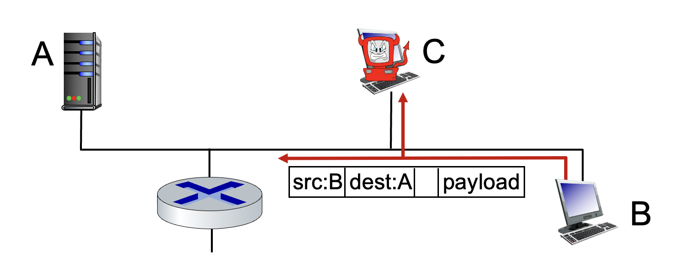
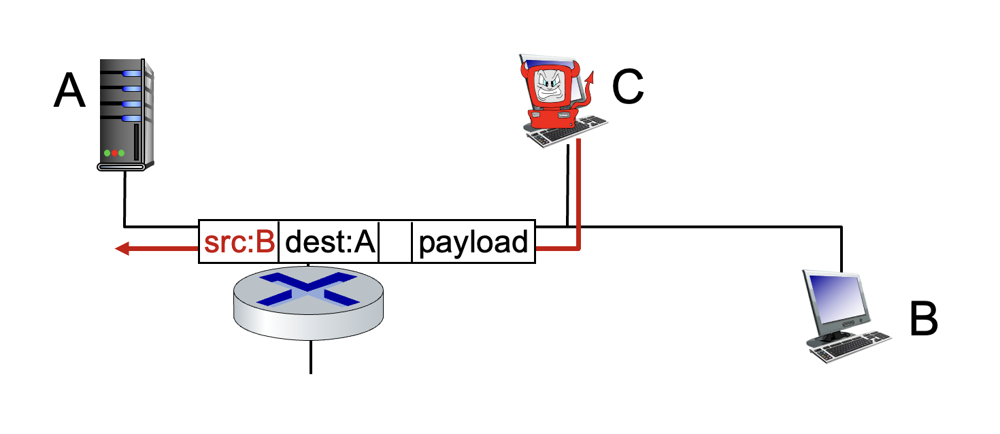
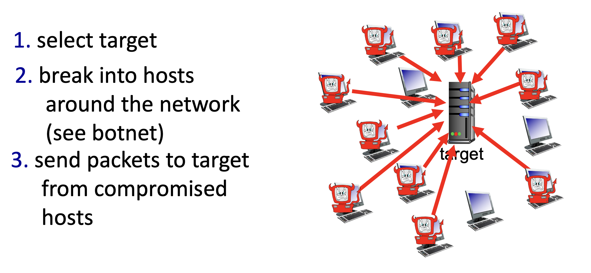

# Week 04 - 고현규

## 1. 네트워크의 처리량 (Throughput)
데이터가 송신자에서 수신자까지 온전히 전송되는 실제 속도를 의미합니다.

* **정의**: 송신자에서 수신자로 비트가 전송되는 속도 (bits/time unit).
    * **순간(Instantaneous) 처리량**: 특정 시점의 전송 속도.
    * **평균(Average) 처리량**: 일정 기간 동안의 평균 전송 속도.
* **병목 링크 (Bottleneck Link)**:
    * End-to-End 경로 상에서 전체 처리량을 제한하는, 즉 **가장 전송 속도가 느린(Throughput이 가장 작은, bandwidth가 가장 낮은) 링크**를 의미합니다.
    * 서버의 전송률($R_s$)과 클라이언트의 수신률($R_c$) 중 더 작은 값이 전체 평균 처리량이 됩니다. ($\min(R_s, R_c)$)
* **네트워크 공유 시나리오**:
    * 백본(Backbone)(SKT, KT, ...) 링크의 대역폭이 $R$이고 10개의 연결이 이를 공평하게 공유한다면, 각 연결의 종단 간(per-connection) 처리량은 $\min(R_c, R_s, R / 10)$이 됩니다.
    * 실제 현대 인터넷 환경에서는 코어 네트워크의 백본 링크($R$, 예시에서 $R/10$)보다는, **사용자나 서버와 직접 맞닿은 액세스 네트워크($R_c$ 또는 $R_s$)가 병목 지점이 되는 경우**가 훨씬 많습니다.

 

## 2. 네트워크 보안 (Network Security)

* **초기 인터넷의 한계**:
    * 초기 인터넷은 서로 신뢰할 수 있는 사용자 그룹을 전제로 한 투명한 네트워크(Transparent Network, 믿음이 전제)를 지향했기에 설계 당시 보안을 거의 고려하지 않았습니다.
    * 현대의 프로토콜 설계자들은 뒤늦게 모든 계층에 보안 요소를 추가하며 아키텍처 방어 메커니즘을 덧붙이고 있습니다.
* **주요 공격 유형 (Bad Guys)**:
    1.  **패킷 스니핑 (Packet Sniffing)**: 브로드캐스트 매체(공유 이더넷, 무선 LAN 등)에서 무차별 모드(Promiscuous mode)를 이용해 지나가는 모든 패킷을 도청합니다. (예: Wireshark).
        * 
    2.  **신분 위장 (IP Spoofing)**: 거짓된 출발지 IP 주소(False source address)를 가진 패킷을 네트워크에 주입하여 신분을 속입니다.
        * 
    3.  **서비스 거부 공격 (Denial of Service, DoS)**: 타겟(서버, 대역폭)을 무의미한 가짜 트래픽으로 압도하여 정상적인 트래픽이 서비스를 이용할 수 없게 만듭니다. (주로 Botnet으로 구성된 좀비 PC들을 이용해 공격을 수행합니다.)
        * 
* **방어 메커니즘 (Lines of Defense)**:
    * **인증 (Authentication)**: 신원을 증명 (이동통신망의 SIM 카드 등 하드웨어 기반 지원이 있으나, 전통적인 인터넷엔 부족).
    * **기밀성 (Confidentiality)**: 암호화를 통한 데이터 내용 보호.
    * **무결성 (Integrity checks)**: 디지털 서명을 통해 데이터가 전송 중 변조되지 않았음을 검증.
    * **방화벽 및 접근 제한 (Firewalls & VPNs)**: 방화벽은 기본적으로 모든 패킷을 차단(Off-by-default)하고 허용된 트래픽만 필터링하는 Middlebox 역할을 수행합니다.

 

## 3. 프로토콜 계층과 참조 모델 (Protocol Layers)

* **계층화(Layering)의 필요성**:
    * 네트워크는 호스트, 라우터, 링크, 애플리케이션, 하드/소프트웨어로 이루어진 거대한 복잡계(Complex System)입니다.
    * 항공 여행 과정(티켓 발권 $\rightarrow$ 수하물 처리 $\rightarrow$ 게이트 탑승 $\rightarrow$ 이륙)처럼 각 단계를 나누어 처리하면 다음과 같은 이점이 있습니다.
        1.  **명시적 구조 (Explicit Structure)**: 시스템 구성 요소 간의 관계를 명확히 식별할 수 있습니다.
        2.  **모듈화 (Modularization)**: 특정 계층의 서비스 구현 방식을 변경하더라도, 다른 계층에 영향을 주지 않아 시스템 유지보수와 업데이트가 매우 용이해집니다.
* **인터넷 프로토콜 스택 5계층**:
    1.  **Application (애플리케이션)**: 네트워크 애플리케이션 지원 (HTTP, SMTP, DNS 등)
    2.  **Transport (트랜스포트)**: 프로세스 간 논리적 데이터 전송 (TCP, UDP)
    3.  **Network (네트워크)**: 출발지에서 목적지까지 데이터그램 라우팅 (IP)
    4.  **Link (링크)**: 인접한 물리적 네트워크 요소 간의 데이터 전송 (Ethernet, WiFi)
    5.  **Physical (물리)**: 실제 회선을 통한 비트(Bit) 단위 전송
    * *(참고: OSI 7계층에는 Application과 Transport 사이에 Presentation, Session 계층이 존재하나, 인터넷 스택에서는 이를 애플리케이션 개발자가 필요에 따라 직접 구현하도록 위임)*
* **캡슐화 (Encapsulation)**:
    * 송신 시 상위 계층에서 하위 계층으로 데이터가 내려오며 각 계층의 제어 정보(Header)가 덧붙여지는 과정입니다. (Matryoshka dolls 구조, 흔히 러시아 인형이라고 알려짐)
    * Application ($Message$) $\rightarrow$ Transport ($Segment$) $\rightarrow$ Network ($Datagram$) $\rightarrow$ Link ($Frame$)
    * 라우터(Router)는 3계층(Network)까지만, 스위치(Switch)는 2계층(Link)까지만 캡슐을 해제(Decapsulation)하여 경로를 결정합니다.

 

## 4. 인터넷의 역사 (Internet History)

* **1961-1972: 패킷 스위칭의 태동**
    * 1961년 Kleinrock의 큐잉 이론으로 패킷 스위칭의 효과가 증명됨.
    * 1969년 ARPAnet 첫 노드 가동. 1972년에 첫 이메일 프로그램 개발 및 NCP 프로토콜 시연.
* **1972-1980: 인터네트워킹 (Internetworking)의 등장**
    * 다양한 독자적 네트워크(ALOHAnet, Ethernet 등) 등장.
    * **Cerf와 Kahn의 인터네트워킹 원칙 (1974)**: 최소주의(Minimalism), 자율성(Autonomy), Best-effort, 무상태(Stateless) 라우터. **(현대 인터넷 아키텍처의 근본)**
* **1980-1990: 새로운 프로토콜의 표준화**
    * 1983년 TCP/IP 배포 및 DNS 정의. 이후 SMTP, FTP 등 주요 프로토콜 정립.
    * 1988년 TCP 혼잡 제어(Congestion control) 도입. 호스트 수가 10만 대 돌파.
* **1990-2000년대: 웹의 상업화와 대중화**
    * 1990년대 초 ARPAnet 종료 및 NSFnet 상업적 이용 허용.
    * Tim Berners-Lee의 HTML, HTTP(Web) 등장. 이후 인스턴트 메시징, P2P 서비스 확산.
* **2005-현재: 클라우드, 모바일, 그리고 거대 서비스 제공자**
    * 무선 접속(4G/5G, WiFi)의 일상화 및 스마트폰 기기 수의 폭발적 증가 (~150억 개 연결).
    * **SDN (Software-Defined Networking)** 패러다임 도입 (2008).
    * Google, Microsoft 등 거대 콘텐츠 제공자(CP)들이 기존 상용 인터넷 망을 우회하는 **자체적인 글로벌 네트워크 인프라(Data center network)**를 직접 구축 및 운용.

 

## 5. 애플리케이션 계층의 원리
네트워크 애플리케이션 개발의 핵심은 종단 시스템(End Systems)에서 실행되는 프로그램을 만드는 것입니다.

* **소프트웨어 구조**: 애플리케이션은 호스트(Host) 위에서 실행되며 네트워크를 통해 서로 통신합니다.
* **네트워크 코어의 불확실성**: 네트워크 코어 장치(라우터, 스위치)는 애플리케이션 계층의 기능을 수행하지 않습니다. 즉, 개발자는 코어 장치를 위한 소프트웨어를 작성할 필요가 없으며, 오직 종단 시스템에서만 앱이 돌아가도록 설계하면 됩니다.

 

## 6. 애플리케이션 아키텍처
애플리케이션이 호스트 간에 어떻게 구조화되는지를 결정합니다.

### 1) 클라이언트-서버(Client-Server) 아키텍처
* **서버(Server)**:
    * 항상 켜져 있는(Always-on) 호스트입니다.
    * 고정된 영구 IP 주소(Permanent IP address)를 가집니다.
    * 대규모 요청 처리를 위해 데이터 센터(Data Centers)에 위치하는 경우가 많습니다.
* **클라이언트(Clients)**:
    * 서버와 통신하며, 항상 켜져 있을 필요가 없습니다.
    * 간헐적으로 접속하며 유동 IP 주소(Dynamic IP)를 가질 수 있습니다.
    * **중요**: 클라이언트끼리는 직접 통신하지 않습니다.

### 2) P2P(Peer-to-Peer) 아키텍처
* 항상 켜져 있는 중앙 서버가 없습니다.
* 임의의 종단 시스템(Peers)끼리 직접 통신합니다.
* **자가 확장성(Self-scalability)**: 새로운 피어가 참여할 때마다 서비스를 요청하는 동시에 파일 등을 공유함으로써 서비스 용량(Capacity)도 함께 증가합니다.
* **한계**: 피어들이 간헐적으로 접속하고 IP가 계속 바뀌기 때문에 관리가 복잡합니다.

 

순수한 P2P는 관리가 어려워 현대의 백엔드 시스템은 기본적으로 클라이언트-서버 모델을 따릅니다. 하지만 대규모 트래픽 분산 처리를 위한 CDN(Content Delivery Network)이나 블록체인 노드 간의 통신 등 특정 도메인에서는 P2P 원리를 결합한 하이브리드 형태가 활발히 사용됩니다.

 

## 7. 프로세스 간 통신 (Processes Communicating)
네트워크에서 실제로 대화하는 주체는 호스트가 아니라 호스트 내의 프로세스(Process)입니다.

* **정의**: 동일 호스트 내에서는 OS의 IPC(Inter-Process Communication)를 사용하고, 서로 다른 호스트 간에는 메시지(Messages)를 교환하여 통신합니다.
* **클라이언트 프로세스**: 통신을 시작하는(Initiate) 프로세스.
* **서버 프로세스**: 접속을 기다리는(Wait to be contacted) 프로세스.
* **소켓(Socket)**:
    * 프로세스가 네트워크로 메시지를 보내고 받는 문(Door) 역할을 합니다.
    * 애플리케이션 계층과 트랜스포트 계층 사이의 인터페이스(API)입니다.
* **프로세스 식별(Addressing)**:
    * 메시지를 받기 위해서는 식별자가 필요합니다.
    * **IP 주소(32-bit)**: 호스트를 식별합니다.
    * **포트 번호(Port numbers)**: 해당 호스트 내의 특정 프로세스를 식별합니다. (예: HTTP는 80번, SMTP는 25번)

 

## 8. 애플리케이션 계층 프로토콜
프로토콜은 서로 다른 종단 시스템에서 실행되는 프로세스들이 어떻게 메시지를 주고받을지 '규칙'을 정의합니다.

* **메시지 타입**: 요청(Request), 응답(Response) 등.
* **구문(Syntax)**: 메시지의 필드 구성 및 배치 방법.
* **의미(Semantics)**: 각 필드에 담긴 정보의 의미.
* **규칙**: 프로세스가 언제, 어떻게 메시지를 보낼지 결정하는 로직.
* **종류**: 공개 프로토콜(HTTP, SMTP 등 RFC 정의)과 비공개 프로토콜(Skype 등).

 

## 9. 전송 서비스 요구사항
애플리케이션의 성격에 따라 필요한 하위 계층(Transport)의 서비스 수준이 다릅니다.

1.  **데이터 무결성 (Data Integrity)**: 파일 전송이나 웹 서비스는 데이터 손실이 없어야 합니다(100% 신뢰성). 반면 오디오/비디오는 약간의 손실을 허용(Loss-tolerant)할 수 있습니다.
2.  **타이밍 (Timing)**: 인터넷 전화(VoIP)나 게임은 낮은 지연 시간(Low delay)이 필수적입니다.
3.  **처리량 (Throughput)**: 멀티미디어 앱은 최소한의 대역폭 보장이 필요합니다. 반면 탄력적 앱(Elastic apps)은 가용한 대역폭에 맞춰 속도를 조절합니다.
4.  **보안 (Security)**: 암호화, 데이터 무결성 보장 등이 포함됩니다.

 

## 10. 인터넷 전송 프로토콜의 특징

### 1) TCP 서비스 (Transmission Control Protocol)
* **연결 지향 (Connection-oriented)**: 데이터를 보내기 전 클라이언트와 서버 간의 셋업(Handshake)이 필요합니다.
* **신뢰적 전송 (Reliable transport)**: 보낸 순서대로 손실 없이 데이터가 도착함을 보장합니다.
* **흐름 제어 (Flow control)**: 수신자가 감당할 수 있는 속도로 송신을 조절합니다.
* **혼잡 제어 (Congestion control)**: 네트워크 전체가 막히지 않도록 송신률을 억제합니다.
* *제공하지 않는 것*: 시간 보장(Timing), 최소 대역폭 보장(Throughput), 보안(Security).

### 2) UDP 서비스 (User Datagram Protocol)
* **비신뢰적 전송**: 데이터 전송 성공 여부를 보장하지 않습니다.
* **No-frills**: 연결 설정도 없고, 흐름/혼잡 제어도 없습니다. 그냥 데이터를 '던지는' 방식입니다.
* **장점**: 오버헤드가 매우 적어 속도가 빠릅니다.

### 3) TCP 보안 (Securing TCP)
* 기본 TCP와 UDP는 암호화 기능이 없습니다. (비밀번호가 평문으로 전송될 수 있음)
* **TLS (Transport Layer Security)**:
    * TCP 위에서 동작하며 **암호화, 데이터 무결성, 엔드포인트 인증**을 제공합니다.
    * 애플리케이션 계층에서 구현되며, 일반적인 TCP 소켓 대신 TLS 라이브러리(API)를 사용하여 통신합니다.
    * 우리가 흔히 쓰는 HTTPS는 HTTP 프로토콜이 TLS를 통해 암호화된 TCP를 사용하는 형태입니다.
