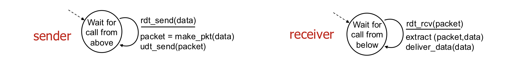
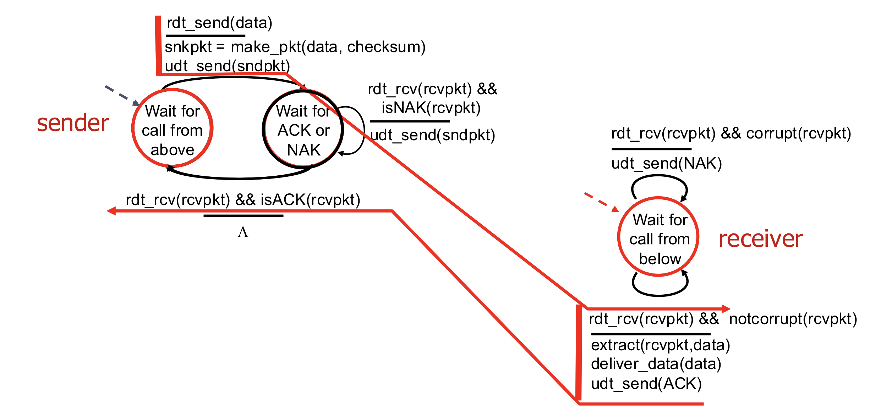
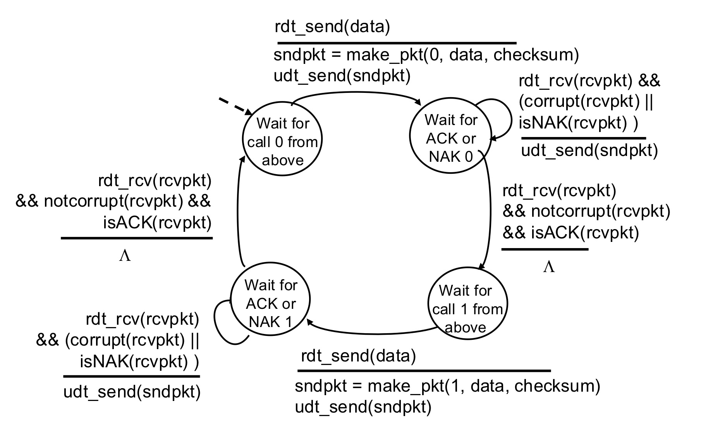
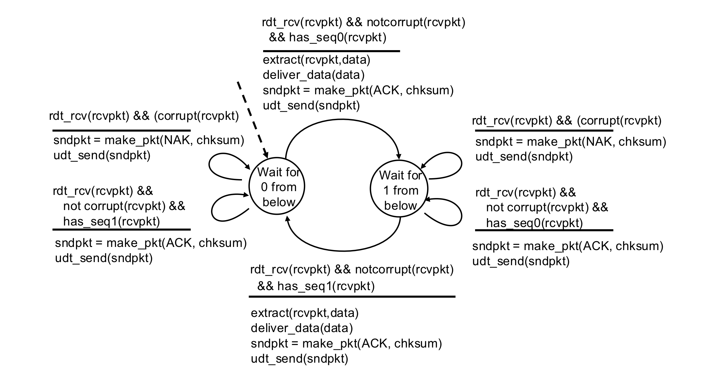
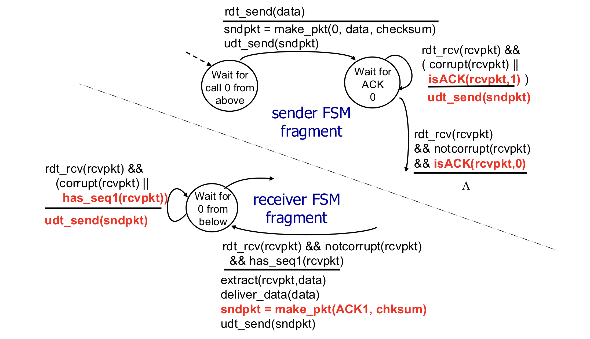
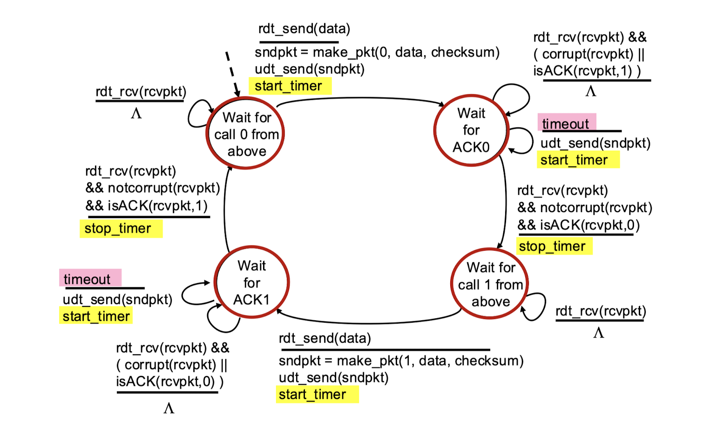

# Principles of reliable data transfer

## 1. 신뢰성 있는 데이터 전송 (rdt) 개요
* **핵심 개념**: 비신뢰적인 채널(unreliable channel) 위에서 신뢰성 있는 데이터 전송 서비스 추상화(abstraction)를 구현하는 것임.
* **특징**: 프로토콜의 복잡도는 하위 채널이 데이터를 얼마나 잃어버리고, 손상시키고, 순서를 뒤바꾸는지에 따라 결정됨.
* **한계**: 송신자와 수신자는 메시지 교환 없이는 서로의 상태(메시지 수신 여부 등)를 알 수 없음.

## 2. rdt 프로토콜의 점진적 발전
### rdt 1.0: 완벽하게 신뢰적인 채널
* 하위 채널에 비트 에러나 패킷 손실이 전혀 없는 상태를 가정함.
* 별도의 제어 로직 없이 데이터 전달만 하면 됨.

### rdt 2.0 ~ 2.2: 비트 에러가 있는 채널
* **에러 검출**: 체크섬(checksum)을 통해 비트 에러를 감지함.
* **피드백**: 수신자가 송신자에게 **ACK**(잘 받음) 또는 **NAK**(에러 발생)를 보냄.
* **재전송**: 송신자는 NAK를 받으면 해당 패킷을 다시 보냄(Stop-and-wait 방식).

* **rdt 2.1 (순서 번호 도입)**: ACK/NAK 자체가 손상될 경우를 대비해 패킷에 **0, 1의 순서 번호**를 붙여 중복 패킷을 구분함.

**rdt 2.1 송신자**

**rdt 2.1 수신자**

* **rdt 2.2 (NAK-free)**: NAK를 사용하지 않고, 마지막으로 잘 받은 패킷의 번호를 ACK에 담아 보냄.

### rdt 3.0: 에러와 손실이 있는 채널
* **타이머 도입**: 송신자가 일정 시간 동안 ACK를 받지 못하면 패킷이 손실된 것으로 간주하고 재전송함.
* **성능 문제**: Stop-and-wait 방식은 한 번에 패킷 하나만 보내고 기다려야 하므로 네트워크 이용률(utilization)이 매우 낮음.

## 3. 파이프라이닝 (Pipelining) 프로토콜
* **개념**: 송신자가 ACK를 기다리지 않고 여러 패킷을 동시에 보내는 방식임.
* **장점**: Stop-and-wait 방식보다 네트워크 이용률을 수 배 이상 높일 수 있음.

### Go-Back-N (GBN)
* **윈도우**: 송신자는 최대 N개의 확인되지 않은 패킷을 가질 수 있음.
* **누적 ACK(Cumulative ACK)**: 수신자는 순서대로 잘 받은 마지막 패킷 번호 n에 대해 `ACK(n)`을 보냄.
* **타임아웃**: 가장 오래된 확인되지 않은 패킷에서 타임아웃이 발생하면, 그 패킷부터 윈도우 내의 모든 패킷을 다시 전송함.

### Selective Repeat (SR)
* **개별 확인**: 수신자는 각 패킷을 개별적으로 확인(ACK)하고, 필요시 버퍼링하여 상위 계층에 순서대로 전달함.
* **재전송**: 송신자는 타임아웃이 발생한 **특정 패킷만** 다시 전송함.
* **SR의 딜레마**: 윈도우 크기와 순서 번호 범위 사이의 관계를 잘못 설정하면 새 패킷과 중복 패킷을 구분하지 못하는 문제가 발생할 수 있음.

 

# Connection-oriented transport: TCP

## 1. TCP Overview
* **1:1 통신 (Point-to-point)**: 하나의 송신자와 하나의 수신자가 연결됨.
* **신뢰성 있는 순차적 바이트 스트림**: 데이터의 경계가 없으며, 보낸 순서대로 정확하게 전달됨.
* **전이중 방식 (Full duplex)**: 동일한 연결에서 양방향으로 동시에 데이터 흐름 가능.
* **연결 지향 (Connection-oriented)**: 데이터 교환 전 핸드셰이킹을 통해 송수신자의 상태를 초기화함.
* **흐름 제어 (Flow control)**: 송신자가 수신자의 처리 능력을 초과하여 데이터를 보내지 않도록 조절함.

 

## 2. TCP 세그먼트 구조 (Segment Structure)
* **포트 번호**: 출발지(Source) 및 목적지(Dest) 포트 번호 포함.
* **순서 번호 (Sequence number)**: 세그먼트의 첫 번째 바이트가 전체 바이트 스트림에서 차지하는 번호임.
* **확인 응답 번호 (Acknowledgement number)**: 상대방으로부터 받기를 기대하는 '다음' 바이트의 번호임 (누적 ACK 방식).
* **플래그 비트**: ACK(확인), SYN(연결 설정), FIN(연결 종료), RST(강제 종료) 등을 표시함.
* **수신 윈도우 (Receive window)**: 수신자가 수락할 의사가 있는 남은 버퍼의 양을 알려주어 흐름 제어에 사용함.

 

## 3. 왕복 시간(RTT) 추정과 타임아웃
* **타임아웃 설정**: RTT보다 길어야 하지만, RTT는 유동적이므로 가변적으로 설정해야 함.
* **EstimatedRTT (추정 RTT)**: 측정된 `SampleRTT` 값들을 지수 가중 이동 평균(EWMA) 방식으로 계산하여 부드럽게 만듦 (보통 $\alpha=0.125$).
* **TimeoutInterval (타임아웃 간격)**: 여유 마진(Safety margin)을 고려하여 설정함.
    * `TimeoutInterval = EstimatedRTT + 4 * DevRTT`

 

## 4. 신뢰성 있는 데이터 전송 및 재전송
* **송신자 이벤트**: 상위 계층에서 데이터 수신 시 세그먼트 생성 및 타이머 시작, 타임아웃 시 해당 세그먼트 재전송, ACK 수신 시 확인된 범위 업데이트.
* **재전송 시나리오**:
    * **ACK 손실**: 송신자가 타임아웃 후 다시 전송함.
    * **조기 타임아웃**: 이미 데이터가 갔더라도 타임아웃이 먼저 발생하면 재전송하며, 수신자는 누적 ACK로 대응함.
* **빠른 재전송 (Fast Retransmit)**:
    * 타임아웃이 길어질 경우 지연이 심해지므로 도입함.
    * 송신자가 동일한 데이터에 대해 **3개의 중복 ACK**(총 4개의 같은 ACK)를 받으면, 타임아웃이 끝나기 전이라도 손실이 발생한 것으로 간주하고 즉시 재전송함.

 

## 5. 흐름 제어 및 연결 관리 (진행 예정)
* 수신 측 버퍼 상태에 따른 송신 속도 조절(rwnd)과 3-way handshaking을 통한 연결 설정/해제 과정이 포함됨.

 

# Network Layer: Data Plane

## 1. 네트워크 계층 서비스와 역할
* **핵심 역할**: 송신 호스트에서 수신 호스트로 데이터그램(Datagram)을 전달하는 것임.
* **송신자 (Sender)**: 트랜스포트 계층에서 받은 세그먼트를 데이터그램으로 캡슐화(encapsulate)하여 링크 계층으로 넘김.
* **수신자 (Receiver)**: 데이터그램에서 세그먼트를 추출해 트랜스포트 계층으로 전달함.
* **라우터 (Router)**: 라우터를 통과하는 모든 IP 데이터그램의 헤더 필드를 검사함. 입력 포트에서 적절한 출력 포트로 데이터그램을 이동시켜 종단 간 경로(end-to-end path)를 따라 패킷을 전달함.

 

## 2. 네트워크 계층의 두 가지 핵심 기능 (Forwarding vs Routing)
* **포워딩 (Forwarding)**: 라우터의 입력 링크로 들어온 패킷을 적절한 출력 링크로 이동시키는 것임. 
  * 비유: 자동차 여행 중 **단일 교차로**를 통과하는 과정 (어느 출구로 나갈지 결정).
* **라우팅 (Routing)**: 패킷이 출발지에서 목적지까지 가는 전체 경로를 결정하는 것임. 
  * 비유: 출발지에서 목적지까지의 **전체 여행 경로를 계획**하는 과정.

 

## 3. Data Plane과 Control Plane
### Data Plane (데이터 평면)
* 라우터 단위의 로컬 기능(Local, per-router function)임.
* 도착한 패킷의 헤더 값을 보고 포워딩 테이블을 참조하여 어느 출력 포트로 내보낼지 결정함.

### Control Plane (제어 평면)
* 네트워크 전체를 아우르는 로직(Network-wide logic)임.
* **전통적 라우팅 (Traditional)**: 각 라우터 내부에 라우팅 알고리즘(CA)이 개별적으로 구현되어 있음. 라우터들끼리 서로 정보를 교환하며 포워딩 테이블을 갱신함.
* **SDN (Software-Defined Networking)**: 라우터 내부에는 포워딩 기능만 남겨두고, 제어 로직은 원격에 있는 중앙 집중형 서버(Remote Controller)로 빼서 관리함. 컨트롤러가 포워딩 테이블을 계산해 각 라우터에 설치해 줌.

 

## 4. 네트워크 서비스 모델 (Network Service Model)
* **최선형 서비스 (Best-effort)**: 인터넷(IP)이 채택한 서비스 모델로, 최선을 다해 배달하지만 **그 어떤 것도 보장하지 않음**.
  * 성공적인 데이터 전송 **보장 안 함 (No)**
  * 패킷의 순서나 타이밍 **보장 안 함 (No)**
  * 최소 대역폭(Bandwidth) **보장 안 함 (No)**
* (참고) ATM 같은 네트워크 구조는 대역폭(CBR/ABR)이나 순서, 타이밍을 보장하는 구조를 가졌음.

 

## 5. 최선형(Best-effort) 서비스 모델의 성공 요인
보장해 주는 것이 아무것도 없는 Best-effort 모델이 전 세계 인터넷을 지배한 이유는 다음과 같음.

* **단순성의 승리 (Simplicity)**: 네트워크 계층을 멍청하고 단순하게 만들었기 때문에, 라우터를 싸고 빠르게 만들 수 있었고 전 세계적인 확산(Deployment)이 가능했음.
* **대역폭 초과 할당 (Over-provisioning)**: 회선 대역폭 자체를 충분히 크게 늘려버리면, 실시간 애플리케이션(음성, 비디오)도 혼잡 없이 꽤 잘 동작함.
* **엣지/분산 컴퓨팅**: CDN(Content Distribution Network)이나 데이터센터를 클라이언트 네트워크 바로 근처에 배치하여 지연 시간을 물리적으로 줄여버림 (예: Netflix, YouTube).
* **상위 계층의 보완**: 네트워크 계층이 잃어버린 패킷은 트랜스포트 계층(TCP)의 혼잡 제어(Congestion control)와 재전송(rdt) 메커니즘을 통해 복구함.